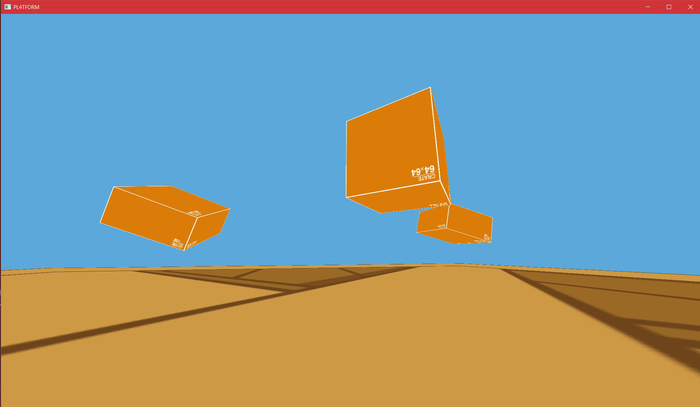

# pl4tform (beta/WIP)

A simple 3D platforming game made in C and OpenGL. It is expected that the gameplay will play similar to a basic platformer with nice movement.

### Preview



### Current Features
- Movement in the ground/air and on moving objects
- Uses SAT algorithm and OBBs for collision detection
- Movement physics response such as resistance and changed velocity on slopes

### To Be Implemented
A TODO list, listed in order of importance and/or utility, top to bottom.
1. Resolve player velocity in the advent of moving objects (including rotation) -mostly resolved
2. Coarse Grid for smart pre-check collision detection rather than check all objects
3. Code Refactor with comments for clarity/efficiency (somewhat complete).

### Potential Features
A reach/extra additions list, listed in no particular order.
- Have Text/UI
- Ability to rebind keys and have main/pause menu
- Clear lose/win states
- Include lighting
- Have more/different models/textures
- Adjust README to have build/helper information

### Controls
- W: Foward
- A: Left
- S: Back
- D: Right
- SPACE: Jump
- ESC: Quit

# How to build
### This currently only builds on Windows 10/11. Inclusion of Linux && MacOS builds is in the works.
If you are on a Linux/MacOS, you need to build GLFW and have the libraries in the same folder of the binary/executable (bin folder).
## Windows 10/11 
It can be built with cmake. You can install CMake here: [Link](https://cmake.org/install/)\
The minimum CMake version is 3.0 but lower versions could work if you change the requirements in CMakeLists.txt.\
Windows specific notes:\
If you want to use mingw compiler rather than .NET/Microsoft (or default) compiler, do the following:\
```cmake -G "MinGW Makefiles" .```\
```make```\
General steps:\
In your preferred terminal, in the platform/ directory
1. Enter "cmake ."
2. Enter "cmake --build ."

And there you go! The output is built in the pl4tform/bin directory, including the source images, glfw dll, and the program.

# File Directory
```bash
|-bin/
	|-//out files / exe
|-Dependencies/
	|-cglm/
	|-glad/
	|-GLFW/
	|-stb_image.h
|-README_imgs/
|-Resources/
	|-Game textures
|-src/
	|-engine/
		|-//engine files like obb collision detection, physics, and world
	|-entity/
		|-//game objects and player
	|-gfx/
		|-//shader, window, glad files (visuals)
	|-include/
		|-//all .h files
	|-utils/
		|-//extra files as helpers.
	|-pl4tform.c
|-README.md
```

# Dependencies
- [OpenGL](https://www.opengl.org/): Graphics specification
- [GLFW](https://github.com/glfw/glfw): Window context
- [glad](https://github.com/Dav1dde/glad): OpenGL function pointer loader
- [cglm](https://github.com/recp/cglm): Helper math library for vectors/quaternions
- [stb_image](https://github.com/nothings/stb/blob/master/stb_image.h): Single header file for image texture generation

